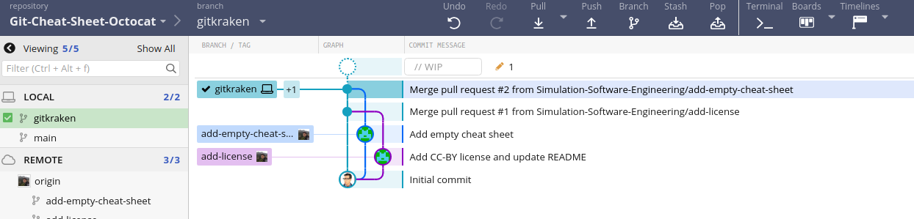
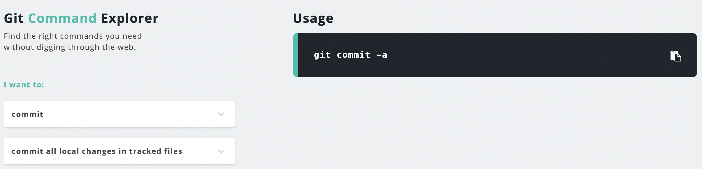

# Git Cheat Sheet – Flavor Octocat

## General Overview of Git structure

An overview of the ``git structure`` can be taken from the above picture. We can simply derive from it that there are 4 distinct blocks:
- working files: our local working directory
- staging area: the changes we want to add to our repository
- local repository: a local environment where we track all our file changes
- remote repository: a remote environment that can be available for other users

## Basic Commands

### Manipulating repositories

* ``git init``: Creates an empty Git repository on your local disk.
* ``git clone``: Creates a local copy of a remote Git repository. Requires HTTPS or SSH URL to clone from.
* ``git pull``: Updates a local copy of a remote Git repository.
* ``git checkout``: Switches to a different branch of a local Git repository. Can also be used to create new branches locally.
* ``git add``: Add a file within the directory structure of a local Git repository to version control.
* ``git commit``: Save currently untracked changes to a local Git repository.
* ``git push``: Updates a remote Git repository to match a local copy. Only works if no new commits have been made remotely on the same branch, else you must pull and merge/rebase first.

### Informative commands

* ``git status``: Display current untracked changes that can be committed.
* ``git log``: Display commits to a local Git repository in order of recency.
* ``git help``: Built-in help for Git commands - supply name of a particular command to learn about it.

## Pull requests and reviews
  
* Create a pull request:
  - a) After commiting your changes, go to "Pull Requests" -> "New pull request". Then, select the source as well as the target branch.
  - b) Alternatively, you can `git push -u myfork mybranch` after the commit. Git will automatically generate the link to the corresponding pull request which you can copy and open in a browser of your choice. 
  - Name the PR and fill out the template to shortly summarize what your PR contains / which changes you propose. You can also directly link to an open issue that is being solved by your changes. For this, simply reference the issue via "#<number_of_the_issue>".
  - Finally, click "Create pull request" to confirm.

* Code review:
  After creating the pull request, you can assign yourself or others as reviewers. Reviewers are being notified that their feedback is required and can request changes or directly edit the respective files if the are allowed to. 
  In general, the review has three possible statuses: 
  - Comment: General feedback and suggestions
  - Approve
  - Request changes: Feedback must be addressed before merging. In this case you can ask for a re-review afterwards.
  To protect certain branches, the administrators of the repository can ask for a specific number of approving review before merging the pull request.

* Close/merge pull request:
  Once the review is approved, there are three ways to merge the pull request:
  - Retain all the commits of a feature branch
  - Squash all commits of the feature branch into a single commit (suggested)
  - Rebasing individual commits
 
  Note: Anyone with push access to the repository can complete the merge.
  If the changes of the pull request are no longer needed or another solution has been proposed in the meantime, it is also possible to close a PR without merging by clicking "Close pull request" at the bottom of the pull request.

## Advanced Commands

* `git blame` : Show what revision and author last modified each line of a file
* `git reflog` : Manage reflog information (equivalent to `git relog show HEAD`)
* `git effort` (from `git-extras` repository) : Show effort statistics on file(s) in repository 
* `git commit -m "Title of commit" -d "Description of commit"` : to specify a commit message and description without going to vim
* `aheadfork` : find GitHub forks that are ahead
* `git stash` : Stash the changes in a dirty working directory away

## Useful tools

- `GitKraken`:
  Git GUI for Windows, Mac & Linux! This intuitive Git GUI simplifies and streamlines Git processes.

  - Free version: 
    you can use the free version with public repositories but not with private ones.
  - Professional version:
    if you want to use the professional version, you can get it via GitHub education pack
    - https://education.github.com/students
    - https://education.github.com/teachers
    
  

  

- `GitExplorer`
  - [GitExplorer.com](https://GitExplorer.com) is a very useful tool which helps novice git users cut through the clutter and find the right git commands without digging through the web.
  
